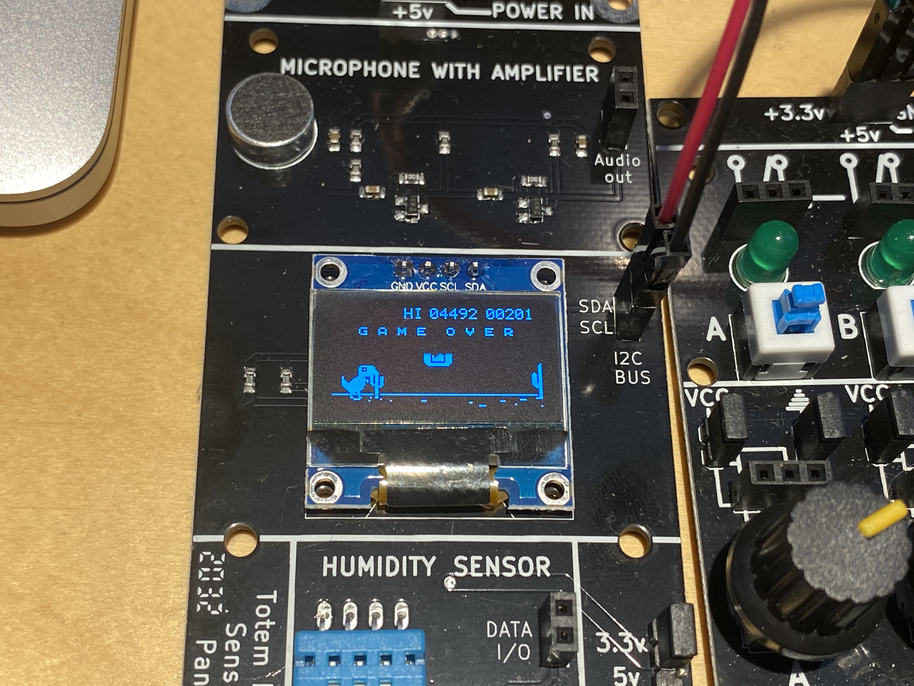
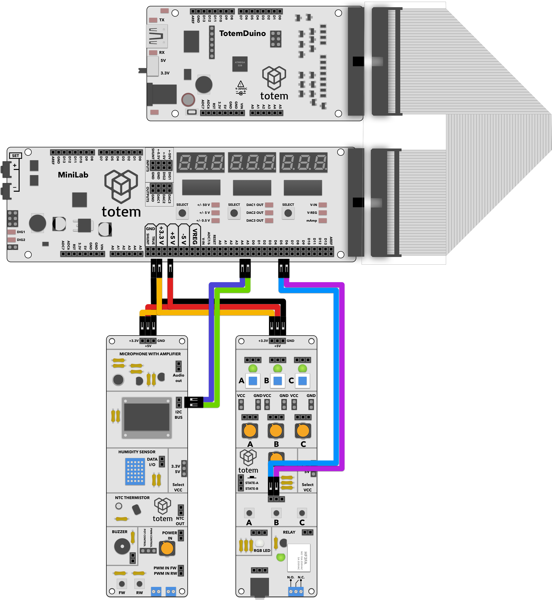

# T-Rex game

A well-known browser game. Used code from AlexIII's T-Rex-duino project, and made it work on TotemDuino. Original authors page available here: [https://github.com/AlexIII/t-rex-duino](https://github.com/AlexIII/t-rex-duino)

Using buttons on IO side panel we're controling our player, making it jump or duck. Using display from Sensor side panel for output.

# Requirements:
1. TotemDuino board
2. Sensor side panel (side panel 2)
3. IO Side panel (side panel 1)
3. 10 male-male breadboard wires.

# Expected result:
Goal of the game is to avoid obstacles as long as you can by ducking or jumping over them. High score is saved in TotemDuino's non-volatile memory and is kept throughout.

# Notes:
1. Modifications from the code by the original author include a special start-up routine for the screen. This involves a number of registers that are set on boot-up.
2. Sometime screen displays visual artifacts -- this is due to the screen working on the edge of allowed data rates to get the best available frame rate, and due to relatively large amount of visual data in game some corruptions are possible.
3. There's an autoplay mode that can be activated by uncommenting line 35:

        #define AUTO_PLAY 
        
# Schematics:

