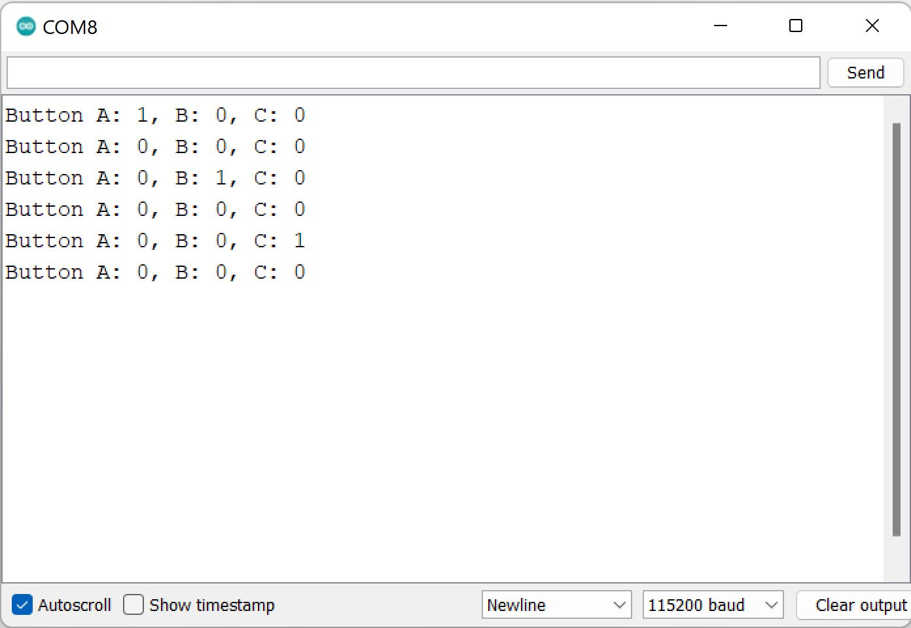
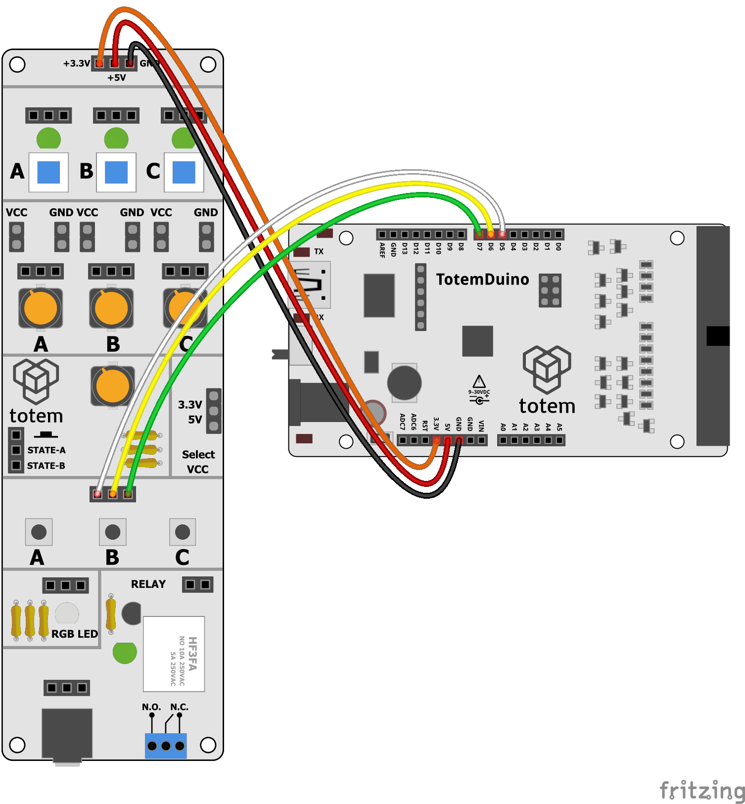

# Button example

This project demonstrates how to hook up tactile buttons to TotemDuino and read their state.  
Turns on input pullup resistors and takes care of button debouncing.  

_Remember to select 115200 baud rate._

## Requirements

1. #1 I/O side panel
1. TotemDuino
1. Jumper wires

## Wiring

Connect wires according to image

