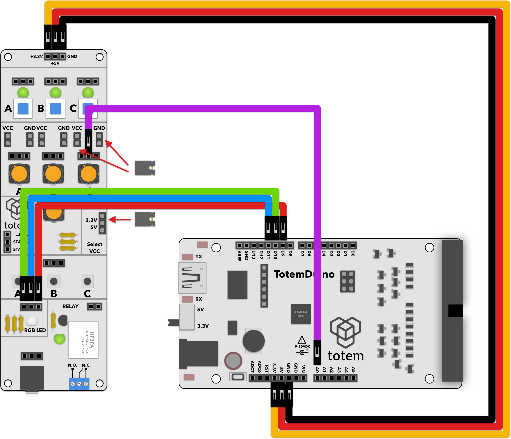

# RGB color control
In here we're using pulse width modulation on three channels to control a single RGB LED. Different color space (HSV) is used for a smooth transition over color spectrum.

# Requirements:
1. TotemDuino board.
2. IO Side panel (side panel 1).
3. 5 male-male breadboard wires.

# Expected result:
Turning potentiometer will cause RGB LED on IO side panel to travel along the color spectrum.

# Notes:
1. RGB led consists of three separate LEDs for each color. You will get better color results if you place some sort of diffuser on top of it (e.g. sheet of paper). 
2. To control color smoothly, we're working in HSV (hue-saturation-value) color space. By keeping value and saturation constant, and traveling through color wheel by chaning hue, we can transition from one color to another smoothly.
 
 
3. We're reading potentiometer position and translating it into a hue value. Later on calculating exact red, green and blue values by using helper functions.
4. As the LEDs are connected to the positive rail, our control signal must be inverted to account for that - meaning low signal level will cause LED to light up and vice versa.
5. We're limitting maximum brightness of the LED by clamping maximum allowable brightness in translation function.

# Schematics:
  