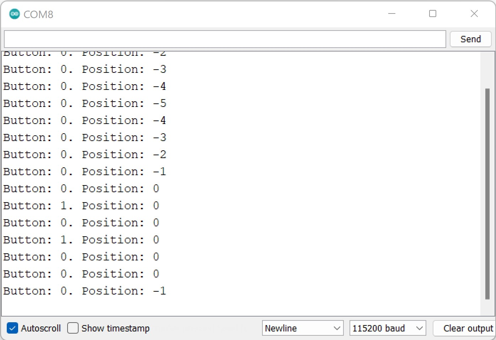

# Rotary encoder example

This project demonstrates how to hook up Rotary Encoder to TotemDuino and track it's position.

_Remember to select 115200 baud rate._

## Requirements

1. #1 I/O side panel
1. TotemDuino
1. Jumper wires

## Wiring

Connect wires according to image

