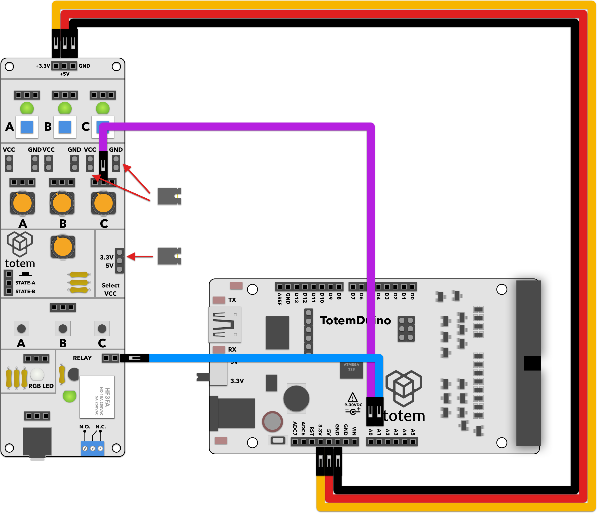

# Schmitt trigger for noisy input
This projects shows typical tools used in control systems where noisy inputs are expected. At the same time, simple input output example is shown here, using potentiometer on I/O side panel as input, and relay module as output.

# Requirements:
1. TotemDuino board.
2. IO Side panel (side panel 1).
3. 5 male-male breadboard wires.

# Expected result:
Turning potentiometer will toggle relay contacts. Also integrated LED on relay module will light up, indicating status.

Two modes of operation is presented, with the line 8 toggling between twe two:

    //To disable SCHMITT_TRIGGER, comment or delete this line
    //#define SCHMITT_ON

# Notes:

1. First check the behaviour without the schmitt trigger (line 8 commented out). Take note of behaviour on the edge of threshold -- due to noisy input from potentiometer, relay control is very unstable.
2. Compare that to the behaviour when line is uncommented (trigger is active). Now you have a window where relay doesn't change it's current output value. 
3. You can check if the trigger is active or not on serial monitor (Tools->Serial monitor in Arduino IDE). Aditionally, each change of relay output is logged there as well.
4. The same principle is applied almost universally across every input device. In this case we had a trigger over value domain, but you could have it working in time domain -- for example you read out a button or switch it registers as a large number of on/off events rather than a single event. Typically this is refered as debouncing - filtering unwanted events by assuming that you have a finite press/release frequency over time period.

# Schematics:
  