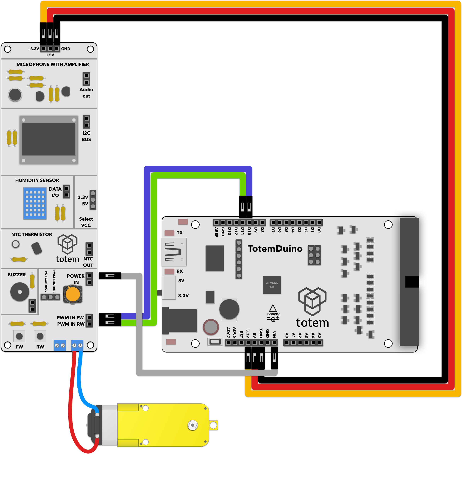

# Motor speed and direction control
Uses motor driver in sensor side panel (side panel 2) for controling DC motor with PWM signals.

# Requirements:
1. TotemDuino board.
2. Sensor side panel (side panel 2).
3. 6 male-male breadboard wires.
4. 12 V compatible DC motor for load.

# Expected result:
Motor should spin up slowly in one direction, subsequently changing direction and repeating.

# Notes:

1. Make sure that the motor you're using is compatible to run from 12 V that TotemDuino uses.
2. We're using PWM, or pulse width modulation technique to quickly turn motor on and off. By warying the amount of time that the motor spends turned in these states, we're effectively controlling average power applied to power.
3. As the driver that we're using in sensor side panel is bi-directional, we can also control the polarity of control signal, meaning that motor can be rotated in both directions.
4. Same (or very similar) technique is used in many other household appliances for controling power applied to devices -- lights, microwave ovens, etc.
5. It can also be used to encode an analog value in a digital signal -- some motors have an integrated position sensor, and accept PWM signal for controlling their precise rotation angle (servos).

# Schematics:
  