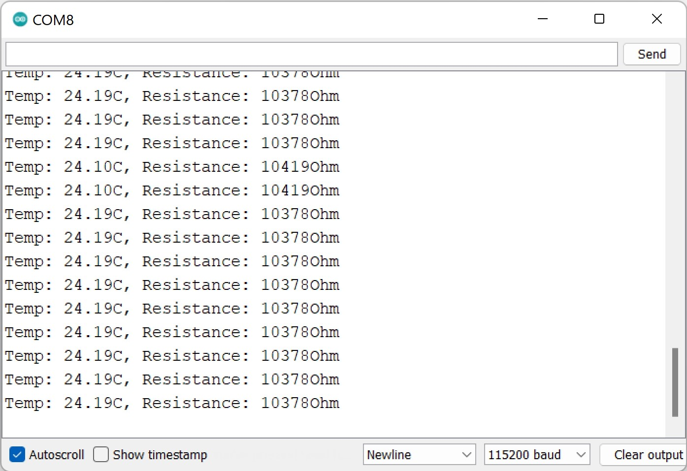
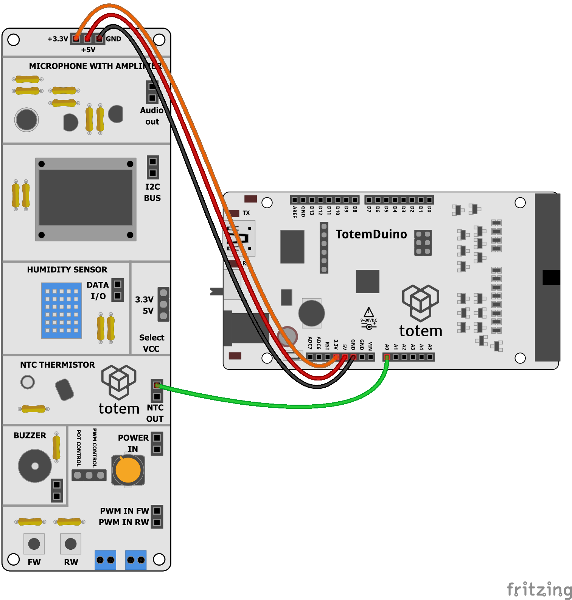

# NTC thermistor example

This project demonstrates how to hook up NTC thermistor to TotemDuino and measure it's temperature.

_Remember to select 115200 baud rate._

## Requirements

1. #2 Sensor side panel
1. TotemDuino
1. Jumper wires

## Wiring

Connect wires according to image

