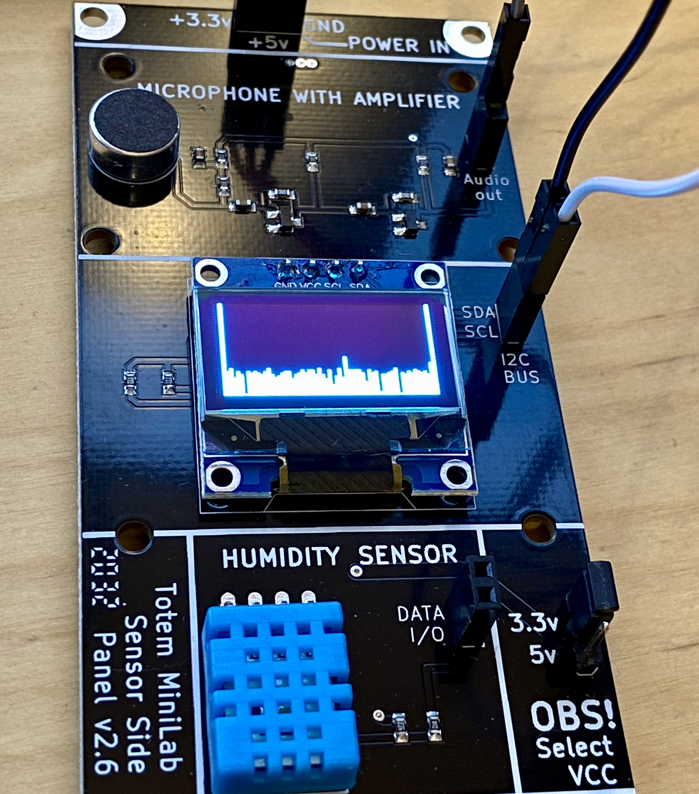
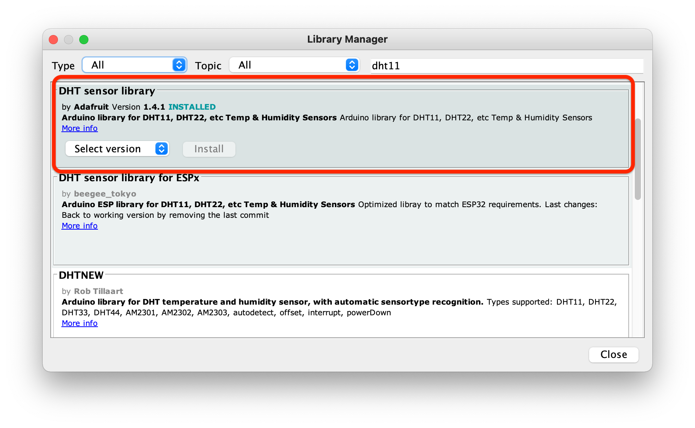
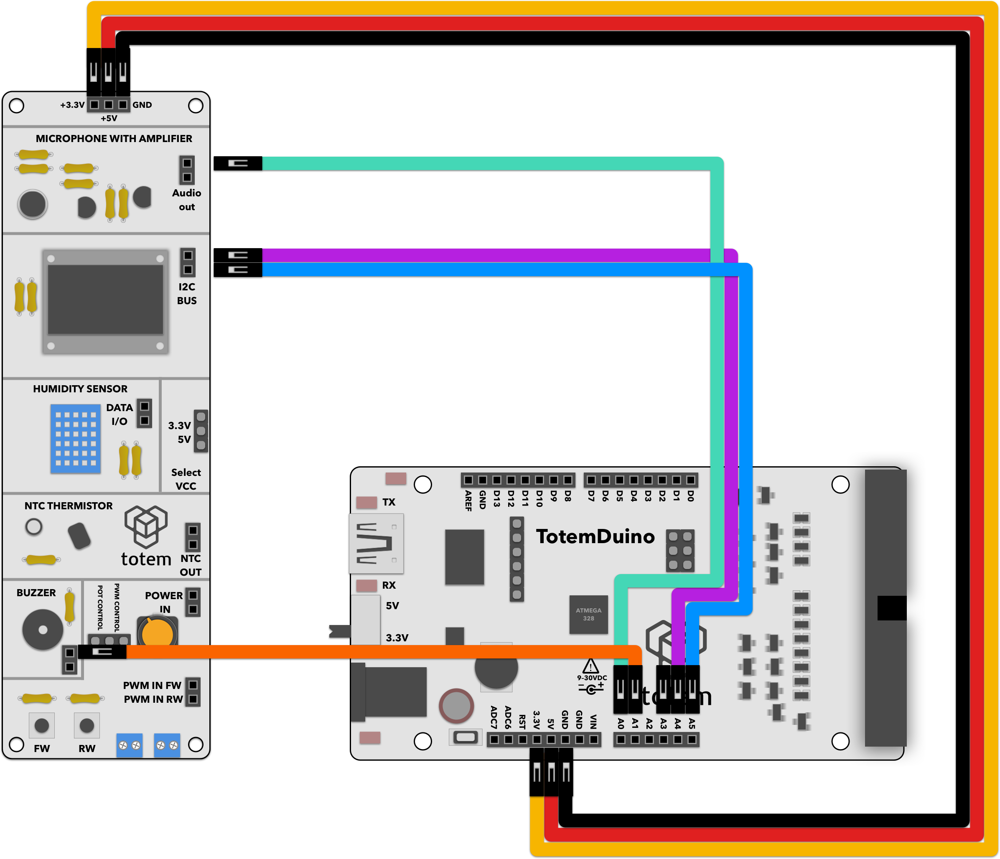

# Sound Alarm

Reads out value from microphone on sensor side panel, compares it to a rolling average, and if conditions are met -- sounds an alarm (buzzer module). Optionally displays collected data on the OLED module.

# Requirements:
1. TotemDuino board
2. Sensor side panel (side panel 2)
3. 7 male-male breadboard wires.

# Expected result:
After making significant noise (e.g. wind blowing, high amplitude sounds) an alarm will sound. Display will show the current historical measured sound levels

# Notes:
We'll be using Adafruit's graphical library together with drivers for the chip used in side panel display.

1. Install the libraries through Arduino Library Manager:

2. Compile and run the project.
3. You may need to adjust threshold values depending on your environment -- increasing TRIGGERVALUE will cause sensitivity to drop.

# Schematics:

