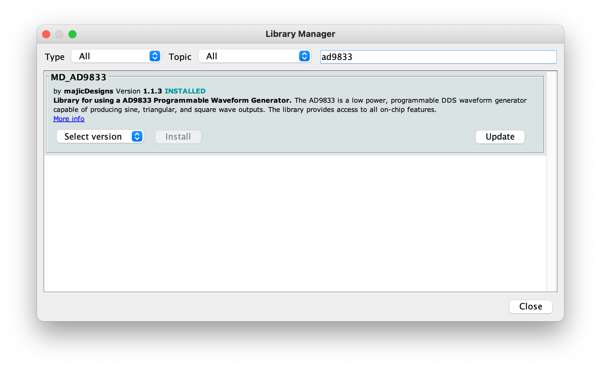

# Minimal generator
Simplest possible usage example of function generator module on audio side panel (side panel 3). Initializes and outputs a static 440Hz sine wave on output.

# Requirements:
1. TotemDuino board
2. Audio side panel (side panel 3)
3. 8 male-male breadboard wires.

# Expected result:
Static 440Hz audio played through speaker.

# Notes:

We're using audio amplifier + speaker module to hear output being played.

Install MD_AD9833 library through Arduino Library manager (Tools>Manager Libraries...):

Make sure that audio amplifier gain (top potentiometer) and function generator output control (bottom potentiometer) is not turned all the way down, otherwise you won't be able to hear anything.

