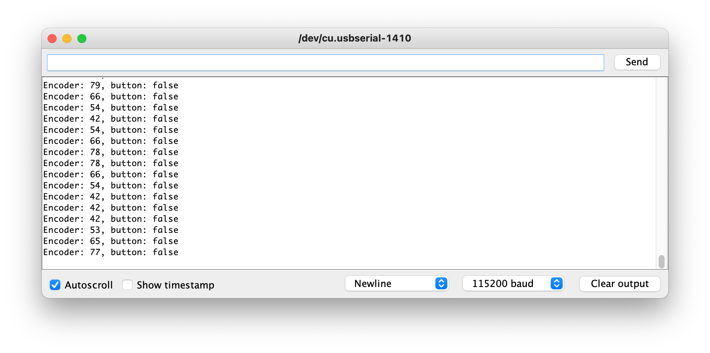
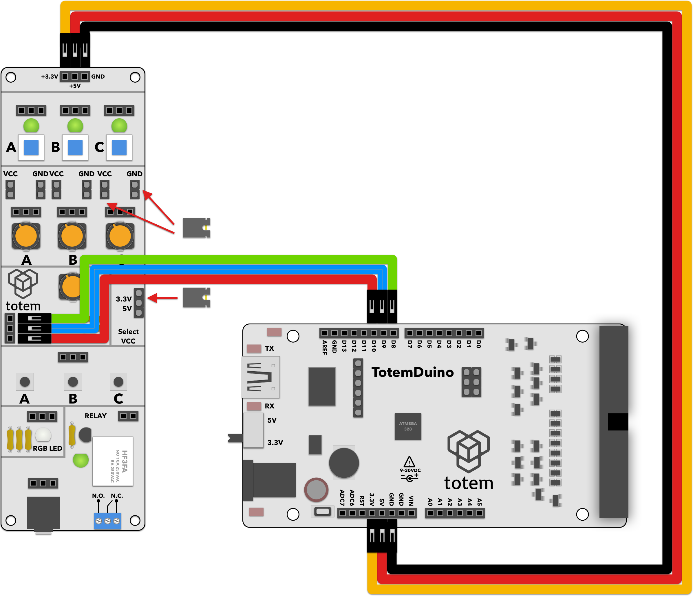

# Encoder demo
Encoders are really useful for user interface -- you not only get several channels of information (rotation direction, speed, angle), but most of encoders also have a convenient push-button integrated into knob. This demo shows how to get the encoder in IO side panel working.

# Requirements:
1. TotemDuino board.
2. IO Side panel (side panel 1).
3. 6 male-male breadboard wires.

# Expected result:
Interacting with encoder will show results on serial monitor in Arduino IDE. 

Monitor output when encoder is rotated

# Notes:
1. Encoder is basically a system of two push switches rotated by 90 degrees. Hence by the relative interaction between these two we can decode rotation direction. Moreover, due to the internal construction these steps (switches activation/deactivation cycles) are spaced equally apart, so we can also calculate speed of rotation as well. This allows us to have optional programmable acceleration and braking routines (e.g. when adjusting volume on a radio quick turns will have more drastic effects than a slow dial-in for minor adjustments).
2. As the encoder on IO side panel only gives us out only the rotation direction, we can't know the absolute position of the knob, only relative from start position. This in some cases limits encoders usefulness (e.g. when you have printed labels on knob that correspond to exact positions).
3. For simpler usability encoder on the IO side panel includes basic debouncing hardware - capacitor together with resistor that acts as a low pass filter, blocking noise due to switch operation to cause several events to be registered by microcontroller.
4. Another important aspect in this project is interrupts - because the knob can be rotated at any time, microcontroller would need to always watch if the conditions hadn't changed. By using interrupts, we're causing a small piece of code to be run when the conditions changes, leaving microcontroller free to run other tasks.

# Schematics:
  