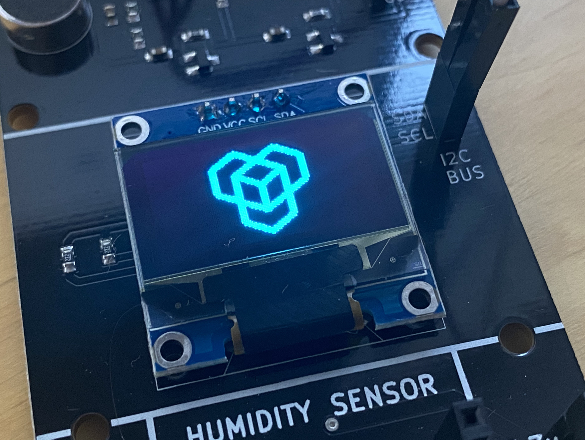
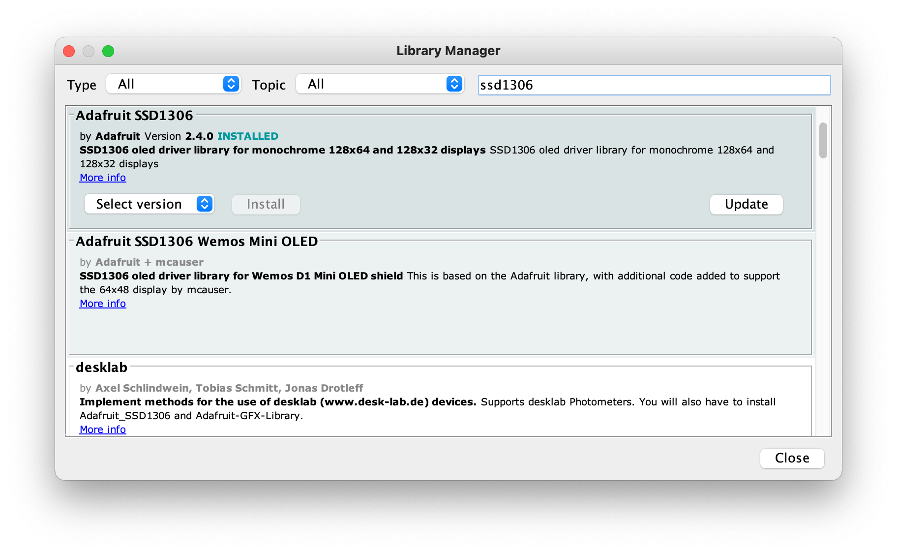
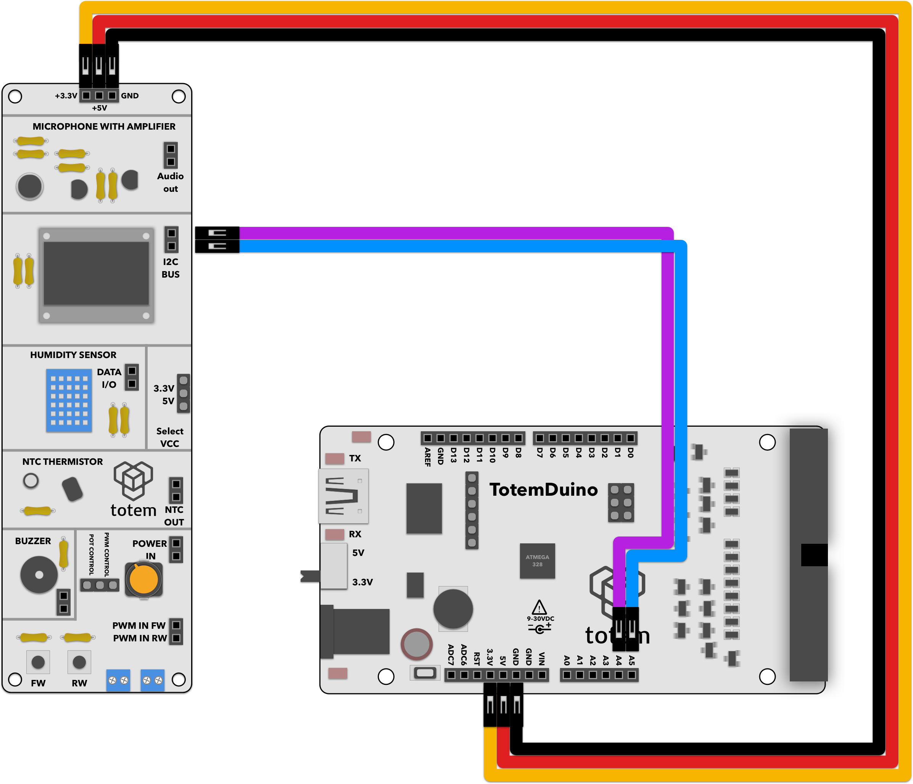

# 128x32 OLED display test

Minimal required steps to establish data connection to the screen, sending it commands to display various graphic elements.

# Requirements:
1. TotemDuino board
2. Sensor side panel (side panel 2)
3. 5 male-male breadboard wires.

# Expected result:
Display should be showing totem logo

# Notes:

The scope of this project is just to confirm that screen is receiving commands sent from TotemDuino board. 
We'll be using Adafruit's graphical library together with drivers for the chip used in side panel display.

1. Install the libraries through Arduino Library Manager:

2. Compile and run displaytest.ino firmware.
3. Confirm that display is showing a totem logo.
4. If display is not working, check schematics, make sure that SDA and SCL aren't swapped, and confirm that power wires are connected.

# Schematics:
