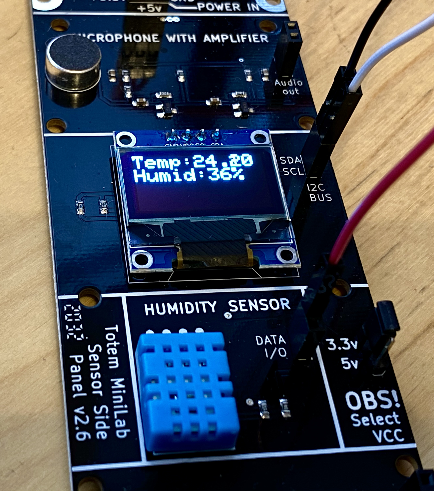
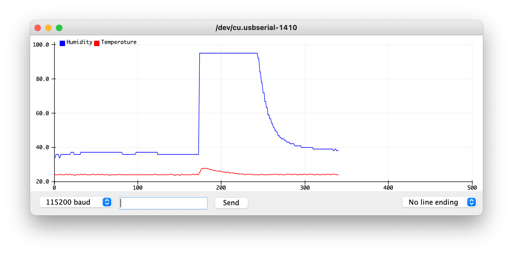
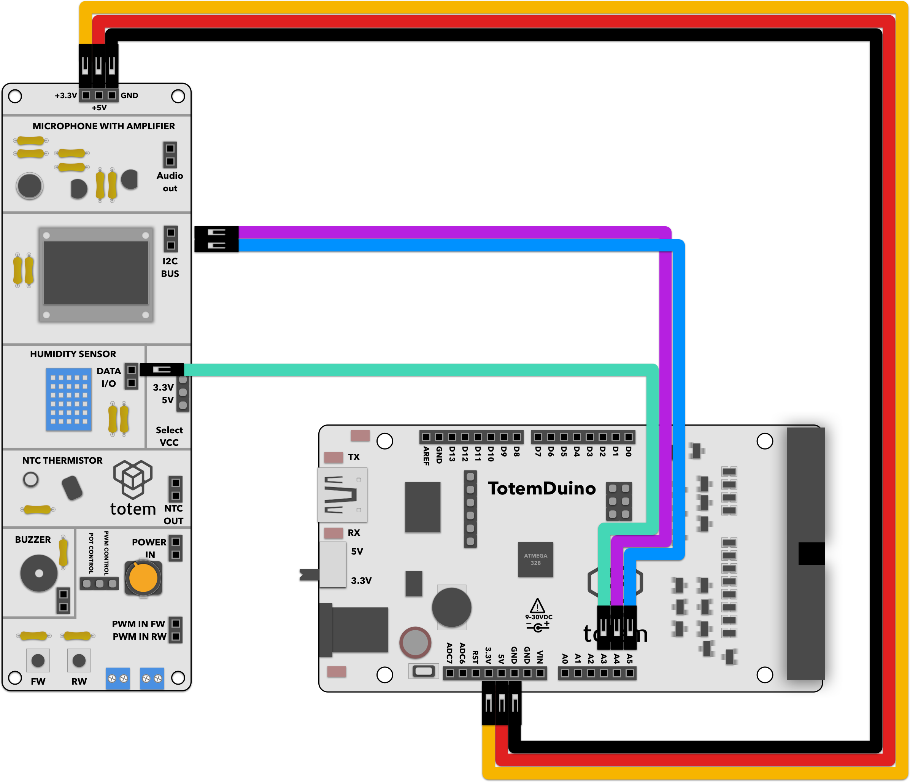

# Temperature and humidity sensor
Reads out and displays sensor measurements.

# Requirements:
1. TotemDuino board
2. Sensor side panel (side panel 2)
3. 6 male-male breadboard wires.

# Expected result:
Temperature and humidity values should be shown on display

# Notes:

We'll be using Adafruit's graphical library together with drivers for the chip used in side panel display.

1. Install the libraries through Arduino Library Manager:

2. Compile and run the project.
3. Find the values printed on the screen.
4. Optionally you can use serial plotter built into Arduino IDE (Tools>Serial plotter) to show historical values:
  
  Showing results of breathing into the sensor.

# Schematics:
  