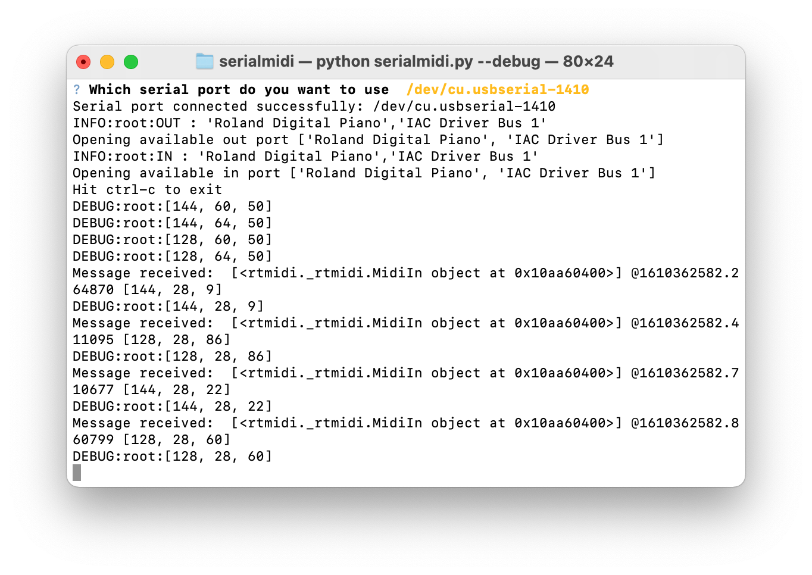
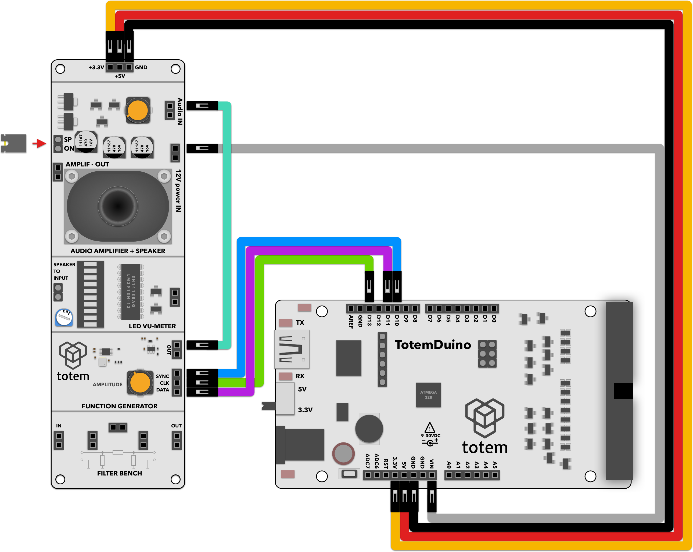

# MIDI synth
Further extends the minimal_generator project. In here we accept serial MIDI stream and generate output square wave signal from there, creating a basic monophonic synthesizer. Together with it, a sample MIDI routing application is used that retransmits information to a serial port, where Totem Duino is connected.
Small video of this demo in action is available here:

[Link to youtube](https://youtu.be/1cHtQSNuXWU)

# Requirements:
1. TotemDuino board
2. Audio side panel (side panel 3)
3. 8 male-male breadboard wires.
4. Computer for MIDI message parsing/retransmitting.

# Expected result:
Generated midi audio from the computer should be heard on side panel speaker.

# Notes:

We're using audio amplifier + speaker module to hear output being played.

Make sure that audio amplifier gain (top potentiometer) and function generator output control (bottom potentiometer) is not turned all the way down, otherwise you won't be able to hear anything.

1. Install computer software by following the guide at:

    [https://github.com/alairock/serialmidi](https://github.com/alairock/serialmidi)

2. Program your TotemDuino with the demo software. Make sure that you can hear a short beep after turning on TotemDuino. This confirms that everything on that side is working correctly.
3. While in the helper application directory, launch serialmidi.py with:
 
    python serialmidi.py

4. Optionally you can supply debug parameter to see flowing messages in and out of the serial port:

    python serialmidi.py --debug

    
    

5. Use any kind of MIDI generating software or hardware compatible with you computer to play notes, which will be passed onto TotemDuino board. In this demo a keyboard has been connected to the computer through USB interface.

6. Due to limitations of our firmware, only one note can be played at a time.

# Schematics

