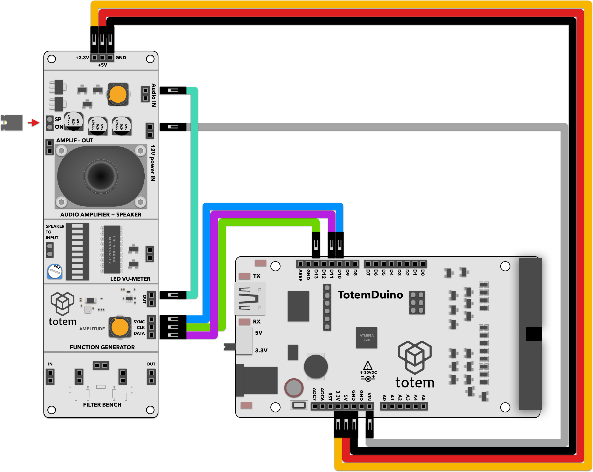

# Minimal generator
Extends the minimal_generator project by adding a very basic note playing ability. Each note consists of two bytes of data (pitch and length), allowing you to play rudimentary monophonic recordings.

# Requirements:
1. TotemDuino board
2. Audio side panel (side panel 3)
3. 8 male-male breadboard wires.

# Expected result:
An 8-bit tune from a well-known video game playing through speaker.

# Notes:

We're using audio amplifier + speaker module to hear output being played.

Make sure that audio amplifier gain (top potentiometer) and function generator output control (bottom potentiometer) is not turned all the way down, otherwise you won't be able to hear anything.

Notes are predefine and hard-coded into melody array.
Negative note length represents dotted notes, so the length is extended by 1.5 times.

Tempo for played music is held in tempo variable, and is expressed as BPM.

Square wave is used as output.

